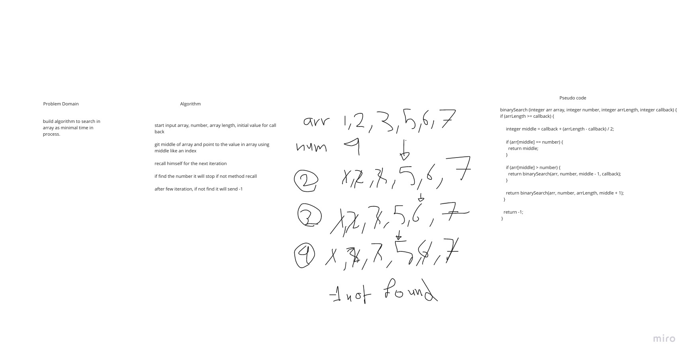

# Reverse an Array

build java method to binary search an array.

## Whiteboard Process

## Approach & Efficiency

Analyzing inputs and outputs, beginning to understand the meaning of an idea and analyze, to build
algorithm to search in array as minimal time in process.
