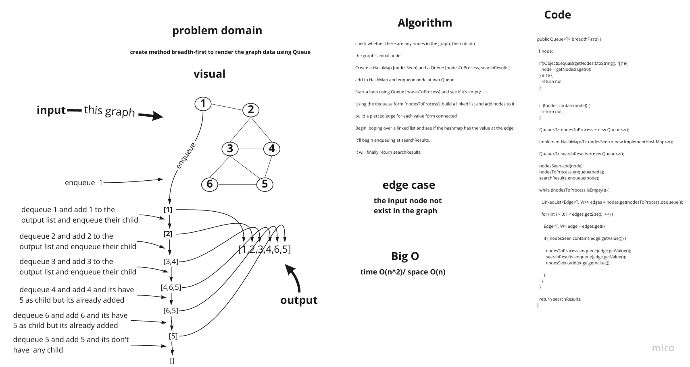
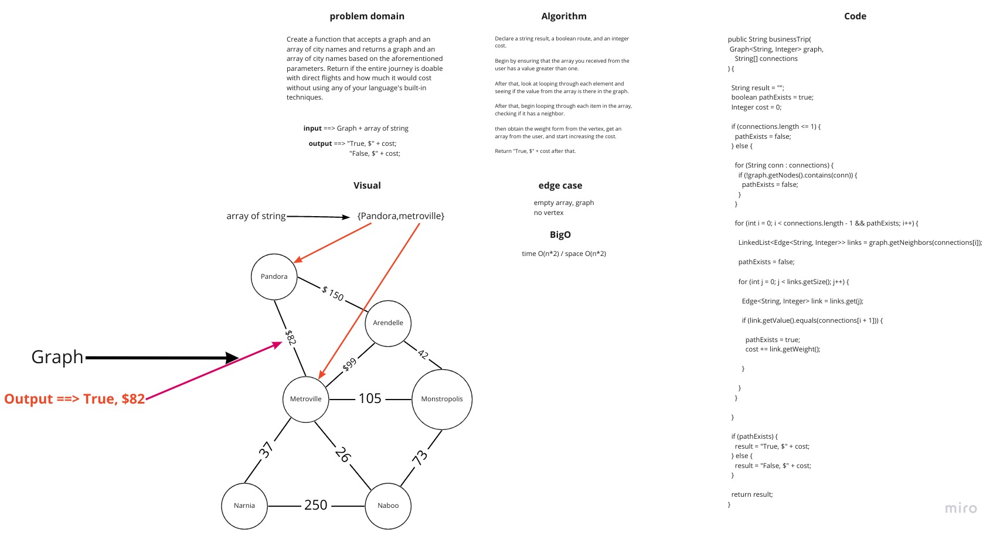

# Graphs
<!-- Short summary or background information -->

Implementation a graph data structure.

## Challenge
<!-- Description of the challenge -->

Add a constructor, getters, and the following methods to a Graph data structure: addNode, addEdge, getNodes, getNeighbors, and size.

## Approach & Efficiency
<!-- What approach did you take? Why? What is the Big O space/time for this approach? -->

* Create a generic Edge class with the same kind of weight and value as the graph node type.
* Create variables for each instance (size, HashMap of nodes and their neighbors with corresponding edges).
* Constructors must be defined.
* Define the addNode function, which returns the additional Node after adding it to the HashMap of the graph Nodes with a LinkedList for its neighbors.
* AddEdge is a method that accepts two nodes and an optional weight and adds them together. Both nodes should be in the graph already.
* Define the getNodes method, which returns a HashMap containing all the graph's nodes.
* Define the getNeighbors function, which returns a LinkedList of a Node's neighbors. The Node must be present in the graph. Return null if the Node is an island.
* Define the breadthFirstTraversal method, which accepts a node and returns a collection of nodes after doing a breadth first traversal.

## API
<!-- Description of each method publicly available in your Graph -->

`addNode()`: is a method that adds a new node to the graph. The value of that node is taken 
into account. Returns the newly created node.

`addEdge()`: Creates a new edge between two nodes in the graph, with the option of specifying a 
"weight." Takes the two nodes that will be linked by the edge into account. Both nodes should be in the Graph already.

`getNodes()`: Returns a collection of all nodes in the graph (set, list, or similar)

`getSize()`: returns the graph's total number of nodes.

`GetNeighbors()`: Returns a list of edges that are linked to the specified node. Takes in a 
certain node. Include the connection's weight in the returned collection.

# Code Challenge: Class 36

## Challenge Summary

Implement a breadth first on a graph.

## Challenge Description

Add a breadth-first method to your graph object that receives a beginning node. Return a collection of nodes in the order they were visited without using any of your built-in functions. Showcase your collection.

## Approach & Efficiency

time O(n^2)/ space O(n)

## Solution

# Code Challenge: Class 37

## Challenge Summary

Is a business trip with direct flights conceivable given a schedule and a route map? If so, what will the overall cost of the trip be?

## Challenge Description

Create a function that accepts a graph and an array of city names and returns a graph and an array of city names based on the aforementioned parameters. Return if the entire journey is doable with direct flights and how much it would cost without using any of your language's built-in techniques.

## Approach & Efficiency

The Big O space is O(n) / time is O(n).

## Solution

