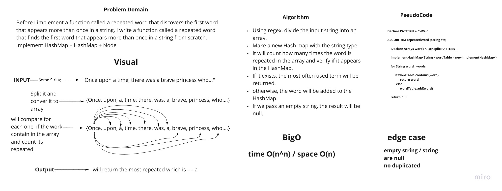

# HashMap
<!-- Short summary or background information -->

A hash map data structure was created from the ground up.

## Challenge

implementation from scratch

## Approach & Efficiency
<!-- What approach did you take? Why? What is the Big O space/time for this approach? -->

put: incorporates both the key and the value.

get: returns the value from the map based on the key.

hashCode: returns an index in the collection based on an arbitrary key.

## API
<!-- Description of each method publicly available to your Linked List -->

`put()` incorporates both the key and the value.

`get()` returns the value from the map based on the key.

`hashCode()` returns an index in the collection based on an arbitrary key.

`resize()` specify a new hash map size

`isEmpty()` check to see if the hash map is empty or not.

