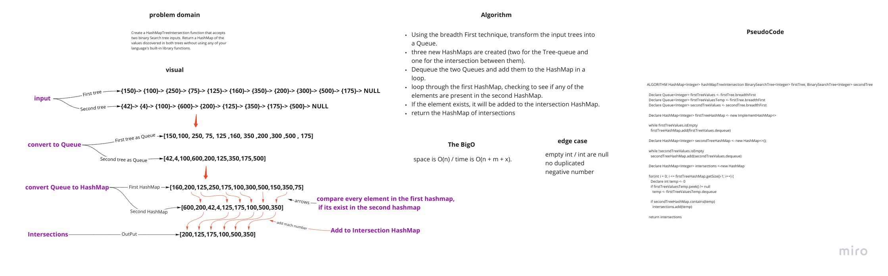

# Challenge Summary

<!-- Description of the challenge -->

Create a HashMapTreeIntersection function that accepts two binary Search tree inputs. Return a
HashMap of the values discovered in both trees without using any of your language's built-in library
functions.

## Whiteboard Process

<!-- Embedded whiteboard image -->

## Approach & Efficiency

<!-- What approach did you take? Why? What is the Big O space/time for this approach? -->

The Big O space is O(n), and the time is O(n + m + x).

