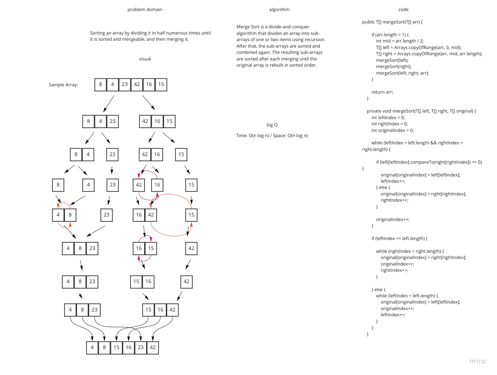

Blog

## Merge Sort

Sorting an array by dividing it in half numerous times until it is sorted and mergeable, and then
merging it.

## Pseudocode

Mergesort(arr) DECLARE n <-- arr.length

```
if n > 1
  DECLARE mid <-- n/2
  DECLARE left <-- arr[0...mid]
  DECLARE right <-- arr[mid...n]
  // sort the left side
  Mergesort(left)
  // sort the right side
  Mergesort(right)
  // merge the sorted left and right sides together
  Merge(left, right, arr)
```

```
while i < left.length && j < right.length
    if left[i] <= right[j]
        arr[k] <-- left[i]
        i <-- i + 1
    else
        arr[k] <-- right[j]
        j <-- j + 1
        
    k <-- k + 1

if i = left.length
   set remaining entries in arr to remaining values in right
else
   set remaining entries in arr to remaining values in left
```

## Trace

```
Sample Array: [8,4,23,42,16,15]
```

Pass 1

First will pass through the array, and then split the array in two.

Pass 2

The array is split into two seperate arrays.

Pass 3

The two arrays will split again.

Pass 4

The left side will be sorted.

Pass 5

The right side will be sorted

Pass 6

Both sides will merge once the sorting is done.

Pass 7

Final iteration will the finished merged array.



## Efficiency

Time: O(n log n) / Space: O(n log n)