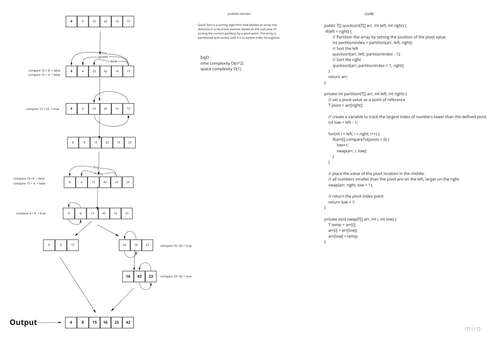

## Challenge Summary

Complete the fast sort challenge and create a blog post about it.

## Challenge Description

Examine the pseudocode below, then follow the steps using the given example array to trace the
method. Document your reasoning by writing a blog post that includes a visual representation of the
result after each iteration. Once you've finished your article, use the pseudocode given to create a
functioning, tested version of Quick Sort.

## Approach & Efficiency

I started by reading the instructions and looking at the pseudocode. Then I prepared the files I'd
require for this assignment. I then wrote the blog using the blog example as a guide. I sketched up
the blog's whiteboard and jotted down a quick rundown of the code. For this challenge, the Big O is
space O(n2), and the Big O is time O(n2).

Solution

