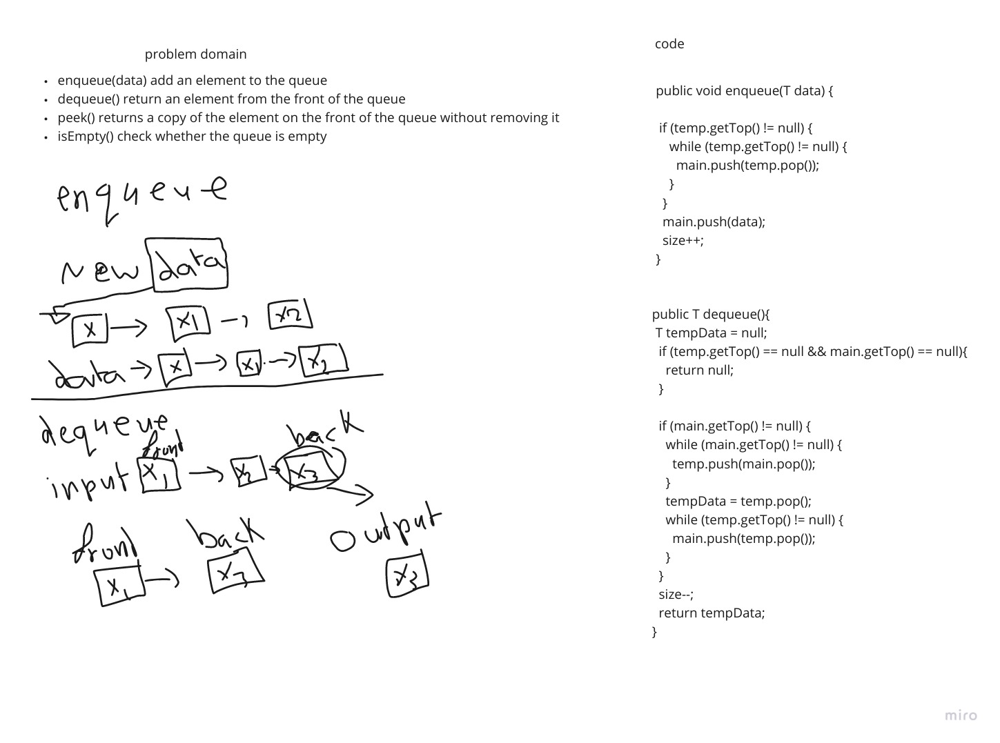

# Stacks and Queues
<!-- Short summary or background information -->

Stacks: Java implementation of a stack data structure.

Queues: Java implementation of a queue data structure

## Challenge
<!-- Description of the challenge -->

Stacks: Implement a stack data structure with a 
constructor, and the following methods: 
push, pop, peek and isEmpty.

Queues: Implement a queue data structure with a 
constructor, and the following methods: 
enqueue, dequeue, peek and isEmpty.

## Approach & Efficiency
<!-- What approach did you take? Why? What is the Big O space/time for this approach? -->

### Stacks

Create tests for each of the items below:

1. When the stack is constructed, a default 
   empty value is assigned to the top. This 
   object should be aware of this.
   
2. Define a method called push that 
   accepts any value as an input and, 
   in O(1) time, adds a new node to the 
   top of the stack with that value.
   
3. Define a pop method that 
   takes no arguments, removes 
   the node from the top of the stack, 
   and returns the value of the node.
   
4. Define a peek method that takes 
   no arguments and returns the 
   value of the node at the top 
   of the stack without deleting it.
   
5. Define a isEmpty method that takes 
   no arguments and returns a boolean 
   indicating whether the stack is empty or not.

### Queues

Create tests for each of the items below:

1. When the queue is established, 
   a default empty value is set to front. 
   This object should be aware of this.
   
2. Define a method called enqueue 
   that accepts any value as an input and, 
   in O(1) time, adds a new node to the rear 
   of the queue with that value.
   
3. Define a dequeue method that 
   takes no arguments, removes the node 
   from the front of the queue, and returns 
   the value of the node.
   
4. Define a peek method that takes no 
   arguments and returns the value of the 
   node at the front of the queue without 
   deleting it.
   
5. Define a isEmpty method that takes 
   no arguments and returns a boolean 
   indicating whether the queue is empty or not.

## API
<!-- Description of each method publicly available to your Stack and Queue-->

### Stacks

* `push(data)` adds an element to the top of the stack

* `pop()` removes an element from the top of the stack

* `peek()` returns a copy of the element on 
  the top of the stack without removing it

* `isEmpty()` checks whether a stack is empty

### Queues

* `enqueue(data)` add an element to the queue

* `dequeue()` return an element from the front of the queue

* `peek()` returns a copy of the element on
  the front of the queue without removing it

* `isEmpty()` check whether the queue is empty

***

# Challenge Summary
<!-- Description of the challenge -->

Implement a Queue using two Stacks, 
Create a new PseudoQueue class. 
Do not use an existing Queue. Instead, 
this PseudoQueue class will implement 
our standard queue interface (the two 
methods listed below), but will 
internally only utilize 2 Stack objects.

## Whiteboard Process
<!-- Embedded whiteboard image -->

## Approach & Efficiency
<!-- What approach did you take? Why? What is the Big O space/time for this approach? -->

### This object should be aware of a default empty value assigned to front when the queue is created.
1. Define a method called 
   enqueue which takes any value 
   as an argument and adds a 
   new node with that value to
   the back of the queue 
   with an O(1) Time performance.
   
2. Define a method called 
   dequeue that does not take 
   any argument, removes the 
   node from the front of the 
   queue, and returns the node’s value.
   
3. Define a method called 
   peek that does not take an 
   argument and returns the value 
   of the node located in the front 
   of the queue, without removing 
   it from the queue.
4. Define a method called 
   isEmpty that does not take 
   an argument, and returns a 
   boolean indicating whether 
   the queue is empty.

## Solution
<!-- Show how to run your code, and examples of it in action -->

* `enqueue(data)` add an element to the queue

* `dequeue()` return an element from the front of the queue

* `peek()` returns a copy of the element on
  the front of the queue without removing it

* `isEmpty()` check whether the queue is empty

