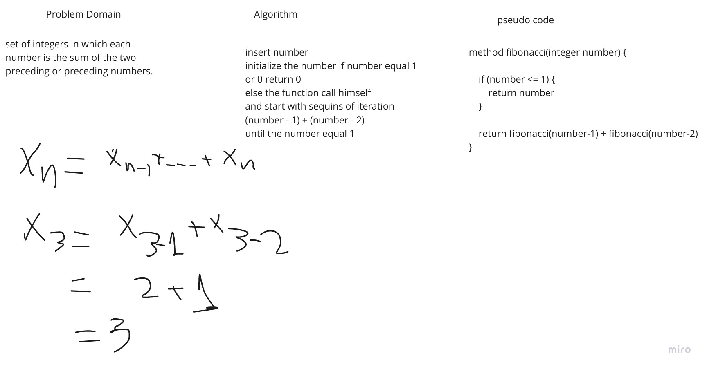

# Reverse an Array

build java method to set of integers in which each number is the sum of the two preceding or preceding numbers.

## Whiteboard Process

## Approach & Efficiency

Analyzing inputs and outputs, beginning to understand the meaning of an idea and analyze, to build algorithm to search in array as minimal time in process.

## Interview questions

Bayan Khalil

Notes [Link](https://docs.google.com/spreadsheets/d/175ewTHbISKfTvSUUK6hr07kQQpoCS_RsUSEk2Ziy5To/edit?usp=sharing)