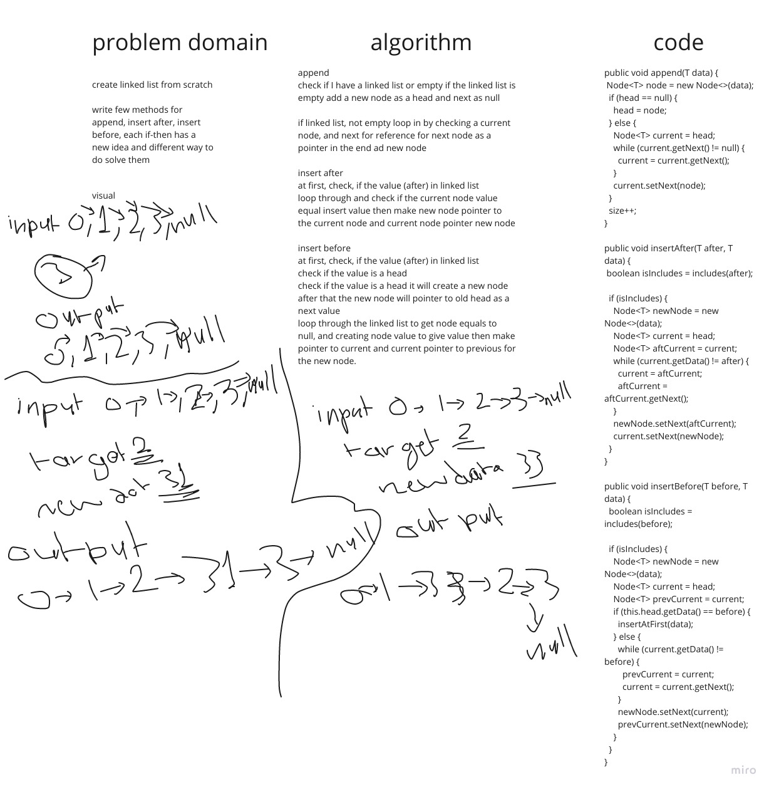

# Singly Linked List
<!-- Short summary or background information -->

## Challenge
<!-- Description of the challenge -->

Write a Linked List from the scratch.

Linked List as some functionality 
like `add`, `insert`, `includes`.

## Approach & Efficiency
<!-- What approach did you take? Why? What is the Big O space/time for this approach? -->

OOP Approach for flexibility and 
exy to read and fix.

O in this approach it not efficient 
because I use `while` for `add`, 
`insert`, `includes`, `print`.

## API
<!-- Description of each method publicly available to your Linked List -->

`add` add the data and check if Linked 
List have head or not, in this method 
it will not returns anything, it is a 
public method.

`insert` insert the data and check if 
Linked List have head or not, in this 
method it will not return anything, 
it is a public method.

`includes` search reserve value and 
check of the Linked List has a size it 
will search at each data in Linked List, 
in this method it will return true or 
false, it is a public method.

`append` insert the data and check if
Linked List have head or not, in this
method it will not return anything,
it is a public method.

`insertAfter` passing two arguments (after, data)
search for after at Linked List after that insert
data in next node.

`insertBefore` passing two arguments (before, data)
search for after at Linked List after that insert
data in previous node.

`insertAtFirst` insert at the first and move the
head to new node add it.

`toString` build in method to print 
the data in class

## Whiteboard Process
<!-- Embedded whiteboard image -->

